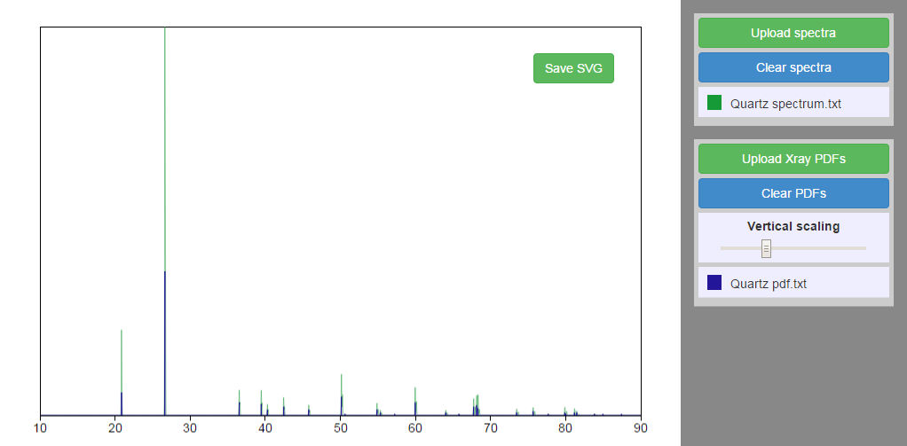

# xrd-plot

Angular app for plotting x-ray powder diffraction data from text files and exporting as SVG.

[http://adamstone.github.io/xrd-plot/](http://adamstone.github.io/xrd-plot/)

`Import diffraction patterns` expects experimental X-ray diffraction data from a text file with a 2-theta column (x) and an intensity column (y), while `Import X-ray PDFs` expects powder diffraction file (PDF) reference data (a text file as above, but with individual peak positions and intensities rather than the full range of 2-theta). Examples of diffraction pattern and PDF reference data files for [quartz](http://rruff.info/quartz/) are included in the data directory for demonstration purposes, since I can't share my actual data.

This is purely a front-end app, so data is only loaded locally into the browser, not sent to a server. 

Colors are randomly chosen and can be changed via color-picker by clicking the color boxes. Multiple diffraction patterns or PDF can be loaded at once. Figures can be saved as SVG for further editing as vector graphics in Illustrator or Inkscape. The plot adjusts if the browser window is resized.

### Motivation

I was looking for a way to get X-ray diffraction data from text files into Inkscape so I could plot vector figures. While there are surely simpler ways to accomplish this, I thought it would be an interesting challenge to try to do it with javascript since I'd been learning Node and Angular and was looking for opportunities for useful small projects. 

Although this involved a lot more boilerplate than a Python script, it was much more conducive to introducing interactive dynamic elements such as vertical scaling controlled by a slider or changing colors with a color picker. Once the basic structure was set up, it was easy to see how new dynamic functionality could be introduced.

### Technologies used
 - Angular.js
 - D3.js
 - Grunt.js
 - Jade
 - Sass
 - Bootstrap

(D3.js is used as an Angular service to convert the data to SVG paths but is not used for data binding)