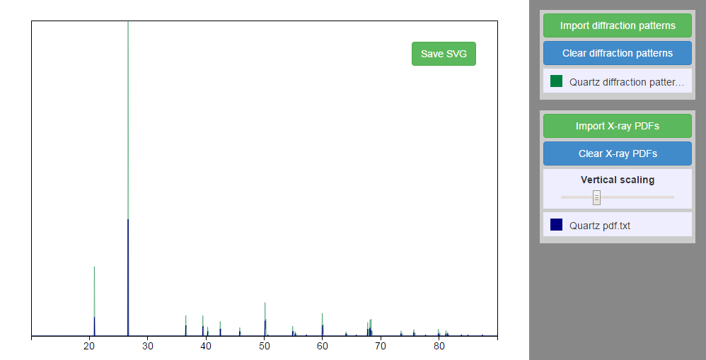

# xrd-plot

Angular app for plotting x-ray powder diffraction diffraction data from text files and exporting as SVG.

[http://http://adamstone.github.io/xrd-plot/](http://http://adamstone.github.io/xrd-plot/)

`Upload spectra` expects collected spectral data from XRD, while `Upload Xray PDFs` expects powder diffraction file data (peak positions and intensities only). An example spectrum and PDF for quartz (http://rruff.info/quartz/) are included in the data directory for demonstration purposes, since I can't share my actual data.

This is purely a front-end app, so data is only loaded locally into the browser, not sent to a server. Colors are randomly chosen and can be changed via color-picker by clicking the color boxes. Multiple spectra or PDF can be loaded at once. Figures can be saved as SVG for further editing as vector graphics in Illustrator or Inkscape. The plot adjusts if the browser window is resized.

### Motivation

I was looking for a way to get XRD spectral data from text files into Inkscape so I could plot vector figures. Usually I'd look for a pythonic way to do this sort of thing, but I thought it would be an interesting exercise to try to do it with javascript since I'd been learning Node and Angular and was looking for opportunities for useful small projects. 

Although this involved a lot more boilerplate than a python script, it was much more conducive to introducing interactive dynamic elements such as vertical scaling controlled by a slider or changing spectrum color with a color picker. Once the basic structure was set up, it was easy to see how new functionality could be introduced.

### Technologies used
 - Angular.js
 - D3.js
 - Grunt.js
 - Jade
 - Sass
 - Bootstrap

D3.js is used as an Angular service to convert the data to SVG paths but is not used for data binding.